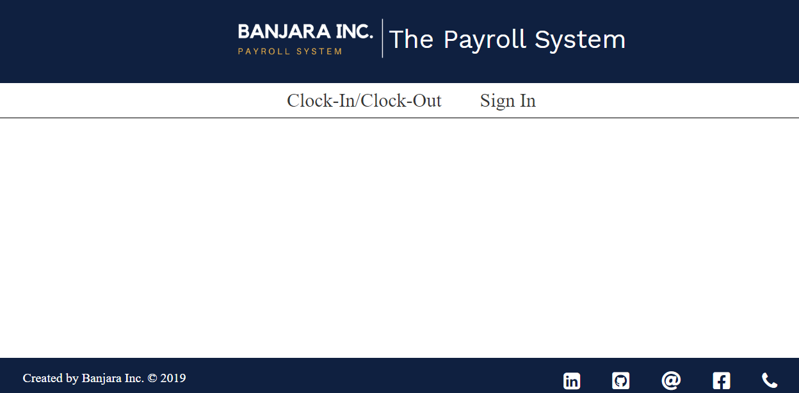
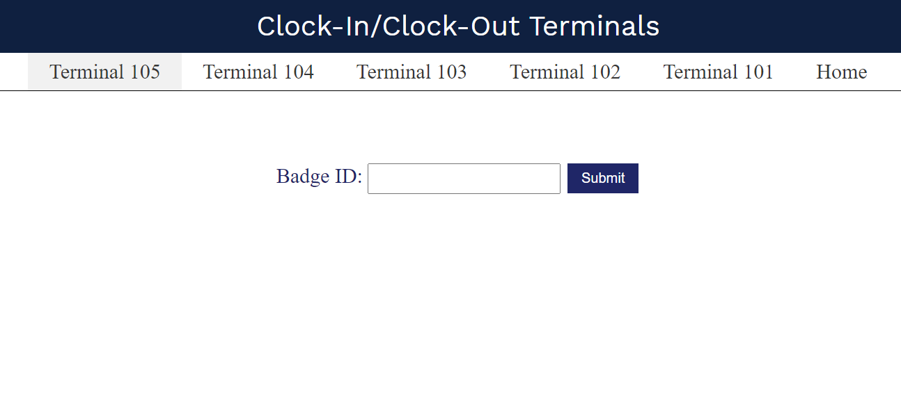
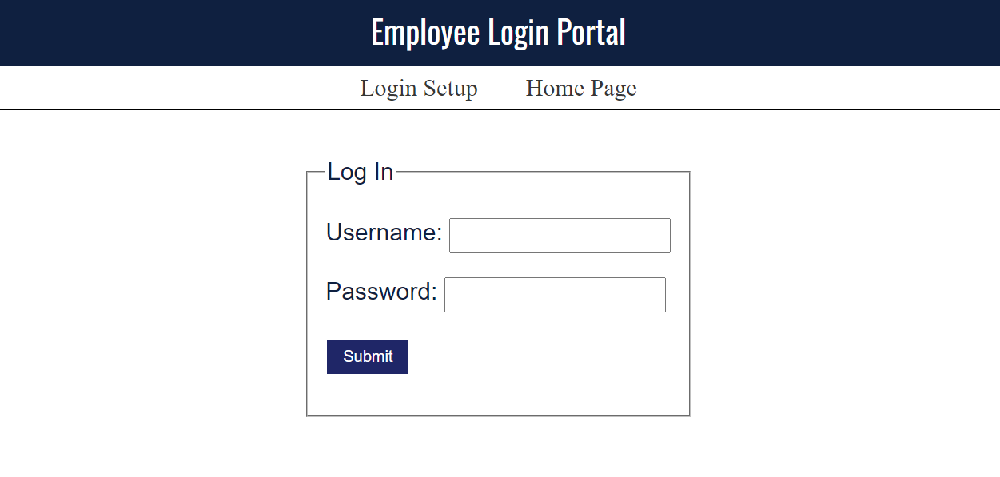

# Payroll System
##
  This is a web based implementation of a Time, Attendance, and Payroll system. This application provides following services to a company;
  i) **Clock-in/Clock-out** terminals via which the employees can clock-in and clock-out.
  ii)**User Login** feature via which an employee can view his/her **time punches** (either daily or a payperiod timepunches) and **Payroll Information** like total pay, total          time worked, and either absenteeism or overtime accured by an employee for a particular payperiod.
##
## Description
   The home page of this application consists of a simple user interface which looks like the picture shown below. It consists of two links namely Clock-In/Clock-Out and Sign In.
   
   
   
   When the user clicks on the link Clock-In/Clock-Out, they are prompted to a page as shown below. This page contains links of terminal 101-105. Each terminal consists of a simple form via which the employees can clock-in and clock-out according to their shifts. In order to register the timepunches, the users should clock-in and clock-out in their corresponding terminals with their badgeids.
   
   
   
   When the user clicks on the link Sign In, they are prompted to a login page as shown below. When the users launch this app, they are prompted directly to this page. For the testing purpose, I have created 2 accounts. The credentials are as follows;
   i) **Username = george and Password = userisgeorge**
   ii)**Username = jessie12 and Password = userisjessie**
   
   
   
   Once you login using the given credentials, you will be prompted to the page shown below. You can retrieve your daily timepunches list by submitting the desired date.
   
   
   
   When you click on the link Pay period PunchList, you will be prompted to the page as shown below. By submitting the desired payperiod date, you can retrieve all of your timepunches for that particular payperiod. Also, it will give you the total time worked (in minutes) and absenteeism percentage for that payperiod.
   
   
   
   When you click on the link Payroll Information, you will be prompted to the page as shown below. By submitting the desired payperiod date, you can retrieve your payroll information like total time that you worked, absenteeism or overtime, and your salary.
   
   
   
##
## Structure
  The directory structure of the source code is as follows:

    project root     (root directory of project, "payroll-system)
               |
                - src             (root directory of the source code)
               |    |           
               |    - java   (all packages go here)
               |    |     |
               |    |     - Payrollfiles.controller    
               |    |     |                        |
               |    |     |                        - Bean.java (Java Bean class which holds user information and interacts with database and Logic class. It interacts with View or Client)
               |    |     |                        |
               |    |     |                        - Database.java (Database class which interacts with the database. It either inserts/gets data to/from a MySQL database)
               |    |     |                        |
               |    |     |                        - Logic.java (Provides essential methods like calculateTotalMinutes(), calculateAbsenteeism(), getPunchListAsJSON(), etc)
               |    |     - Payrollfiles.model
               |    |                         |
               |    |     |                   - Absenteeism.java (Absenteeism class which is an abstraction of an employee's absenteeism for a payperiod)
               |    |     |                   |
               |    |     |                   - Badge.java (Badge class which is an abstraction of an employee's badge)
               |    |     |                   |
               |    |     |                   - Punch.java (Punch class which is an abstraction of an employee's time punch)
               |    |     |                   |
               |    |     |                   - Shift.java (Shift class which is an abstraction of an employee's shift)
               |
                - web
                    |
                    - main
                    |     |
                    |     - main.jsp (It checks if the userrole is employee, if so directs to the user-home.jsp) 
                    |     |
                    |     - user-home.jsp (Main page which is prompted after the login. Contains links to view the timepunches) 
                    |     | 
                    |     - payperiod_punchlist.jsp (Web page via which the users can view their payperiod timepunches) 
                    |     | 
                    |     - payroll.jsp (Web page via which the users can view their payroll information) 
                    |
                    - META-INF
                    |        |
                    |        - context.xml (It adds resources for database pooling and realm for security purpose) 
                    |
                    - public
                    |      |
                    |      - cssfiles (Folder which contains css files namely login.css and main.css) 
                    |      |
                    |      - images (Folder which contains images) 
                    |      |
                    |      - index.html (Home page of this application) 
                    |      |
                    |      - login.jsp (Login page) 
                    |      |
                    |      - logout.jsp (Logout page)
                    |      |
                    |      - terminal.jsp (Web page which represents terminal 105. It consists of a simple form UI) 
                    |      |
                    |      - terminal101.jsp (Web page which represents terminal 101. It consists of a simple form UI)  
                    |      |
                    |      - terminal102.jsp (Web page which represents terminal 102. It consists of a simple form UI) 
                    |      |
                    |      - terminal103.jsp (Web page which represents terminal 103. It consists of a simple form UI)  
                    |      |
                    |      - terminal104.jsp (Web page which represents terminal 104. It consists of a simple form UI) 
                    |
                    - WEB-INF
                    |      |
                    |      - web.xml (configuration for security and login) 
                    
##
##  Important Classes and their Methods
##
### Database Class
   Database class is responsible for connecting the database (cs425_p2). It either gets the data associated with the user or adds data into the database. It has following methods;
   ##
   i) **public HashMap<String, String> getUserInfo(String username)** = It retrieves user's information (id and displayname) and adds it to the Hashmap and returns it.
   ##
   ii) **public String getSkillsListAsHTML(int userid)** = It retrieves all the skills from the database and stores them in a string as a checkbox. If the applicants already have those skills, then the checkbox will be checked. It returns the skills string.
   ##
   iii) **public void setSkillsList(int id, String[] skills)** = It updates the user's skills in the applicants_to_skills table. When the user selects the skills, they are passed as an argument along with the user id. And the skills are updated.
   ##
   iv) **public String getJobsListAsHTML(int userid, String[] skills)** =  It retrieves all the jobs from the database that matches the user's skills. It returns the jobs as a string.
   ##
   v) **public void setJobsList(int id, String[] jobs)** = It updates the user's jobs in the applicants_to_jobs table. When the user selects the jobs, they are passed as an argument along with the user id. And the jobs are updated.
##
### Bean Class
   It hold user's information: username, displayname, id, and list of skills and jobs. It has five instance fields namely username, displayname, skills, jobs, and id. It has following methods along with the getter and setter methods for the instance fields;
   ##
   i) **public void setUserInfo()** = It pulls up information from the getUserInfo(String username) method of Database class, and sets the value of id and displayname.
   ##
   ii) **public String getSkillsList()** = It gets all the user's skills from the getSkillsListAsHTML(int userid) method of Database class.
   ##
   iii) **public String setSkillsList()** = It sets the user's skills by calling the setSkillsList(int id, String[] skills) method of Database class.
   ##
   iv) **public String getJobsList()** = It gets the user's jobs by calling the getJobsListAsHTML(int id, String[] skills) method of Database class.
   ##
   iii) **public String setJobsList()** = It sets the user's jobs by calling the setJobsList(int id, String[] jobs) method of Database class.
   ##
##
### Logic Class
##
## Configuring the Database for the Database Pooling
   To run this application, you'll need to import the application database (**TAS_SP19.sql**). After importing the database, you'll need to create database accounts for it, and grant these accounts the appropriate permissions in MySQL. To do this, please run the following command from an SQL client while logged in to MySQL as root:
 ##
         source C:\USER\Desktop\TAS_SP19.sql ( It assumes the location of sql file is in Desktop. It may be different for you.)
         create user 'db_auth'@'localhost' identified by 'Payroll-SystemDb';
         create user 'db_user'@'localhost' identified by 'Payroll-SystemDb';
         grant select on tas.login to 'db_auth'@'localhost';
         grant select on tas.user_to_role to 'db_auth'@'localhost';
         grant all on tas.* to 'db_user'@'localhost';
         flush privileges;
 ##
   The **"db_user"** is for the database pool and **"db_auth"** is for a restricted account for user authentication while login.
##
## Running this Project
   To run this project, you'll need MySQL, Java (particularly Java 8), Apache Tomcat Server, and Netbeans. If you don't have these tools, you can install them as described here (https://github.com/sbanjara/RequiredTools-Installation). Once you have all these required tools, you can clone this repository by running this command,
   ##
                     git clone https://github.com/sbanjara/payroll-system
   ##
   Once this project is cloned in your workstation, you can create a new web app using existing sources (i.e. src and web folder) in the Netbeans and run it!!
  
  
